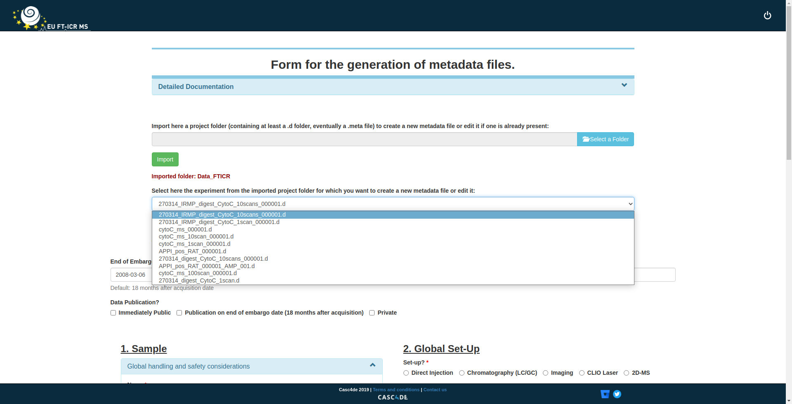

# EUFTICRMS_Metadata

This repository contains the standalone form for metadata creation which is embed within the EU-FTICR-MS data processing platform

## Running the program
The form can be seen and used locally by running: `python run.py` inside the main folder.

## Usage

Run the script as indicated before, a webpage should automatically open in your browser. If it does not open, go to "http://127.0.0.1:5005/create_metadata/" on a web browser.
NB: The code has been developed and tested under a chrome or equivalent browser (e.g. Chromium) - there might be bugs under other browsers.

From the page with the form displayed, in the file selector, choose a folder containing your experiments (the folder should at least contain 1 ".d" Bruker Folder). Import it - it can require two validations in some browsers. Select the desired experiments among those present in the imported folder. Then complete the fields within the form which a relevant to you, and download your .meta file at the bottom of the form.

Here is a screenshot of what the program should look like:

## OS Compatibility

The code has been developed and is compatible with a **linux 18.04** distribution. 
It has also been tested and it is working under **Windows 10** operating system.

## Requirements and versions

The code has been tested and is compatible with **Python 3.8.10** (Earlier versions of python are normally also compatible).
As stated in the requirements.txt, the following libraries are required to run the program:

* Flask==1.0.2
* spike-py==0.99.27
* Werkzeug==0.14.1
* matplotlib==1.16.0
* scipy==1.8.0
* tables==3.7.0
* numpy==1.19.5
* psutil==5.9.0
* python_dateutil==2.8.2